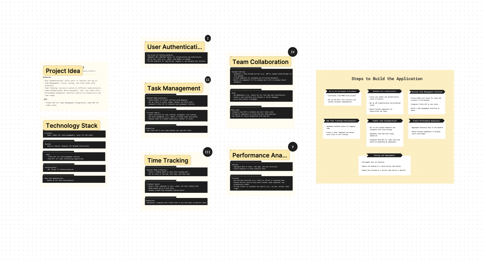

# 🚕 Hire Vehicles NYC TLC

> - A Full Stack MERN Application With CRUD
> - Enhancing NYC's Taxi Service through User Reviews and Data Transparency 🗽

## 🌟 Live Demo

| Screen capture                                           |
| -------------------------------------------------------- |
|  |

## 📋 Table of Contents

- [Overview](#overview)
- [Problem](#problem)
- [Solution](#solution)
- [Features](#features)
- [Technology](#technology)
- [APIs](#apis)
- [Takeaway](#takeaway)
- [What's next?](#whats-next)

## 📖 Overview

Hire Vehicles NYC TLC aims to improve the taxi service in New York City by leveraging user reviews and data transparency. This project provides an interface for users to review drivers, helping to highlight top performers and areas needing improvement.

## 🛑 Problem

Despite NYC's extensive taxi network, there is a lack of transparent, user-generated feedback on driver performance. This gap makes it difficult for passengers to make informed choices and for service providers to improve.

## 💡 Solution

Our application collects and displays user reviews for NYC taxi drivers. By integrating with the NYC data API for hire vehicles, we provide a comprehensive platform for feedback, aiming to enhance the overall quality of the taxi service.

## 🌟 Features

1. **Rate and Review Drivers**: Users can rate and review drivers, providing feedback on their experiences.
2. **Driver Profiles**: Detailed profiles for each driver, including license information and review summaries.
3. **Top Drivers**: Highlighting the best drivers based on user reviews.
4. **Admin Panel**: Manage drivers, reviews, and user accounts.

## 🚀 Technology

- **Frontend**: React, Tailwind CSS, Axios
- **Backend**: Node.js, Express.js, MongoDB, RESTful API
- **Tools**: Vite, Postman, Git, GitHub

## 🌐 APIs

- **NYC Hire Vehicles API**: [NYC Open Data](https://data.cityofnewyork.us/resource/8wbx-tsch.json)

## 📅 Gantt Chart

| Snapshot                                              |
| ----------------------------------------------------- |
|  |

## 🎨 Design Process

| [Design Process, Planning]() |
| ------------------------------------------------------------------------------- |
|  |
|  |

## 📝 Takeaway

- **User Feedback**: The project underlines the importance of user feedback in improving service quality.
- **Data Transparency**: Demonstrates how open data can be leveraged to provide transparency and improve public services.
- **MERN Stack Proficiency**: Provides hands-on experience with the MERN stack, enhancing full-stack development skills.

## 📋 What's next?

To further enhance the Hire Vehicle Application, the following features and improvements can be added:

### 1. Image Upload for Reviews
- Allow users to upload images along with their reviews to provide visual feedback about the vehicle or driver.
- Integrate a file storage service (e.g., AWS S3, Cloudinary) to handle image uploads and storage.

### 2. Driver Profiles
- Create detailed driver profiles that include driver ratings, reviews, and a brief biography.
- Allow drivers to update their profiles with personal information and achievements.

### 3. Advanced Search and Filtering
- Implement advanced search and filtering options for users to easily find vehicles based on various criteria such as price, type, availability, and location.
- Add sorting options for search results (e.g., by rating, price, or distance).

### 4. Booking and Reservation System
- Develop a booking and reservation system that allows users to book vehicles directly through the application.
- Integrate payment gateways (e.g., Stripe, PayPal) for secure online payments.

### 5. Notification System
- Implement a notification system to keep users informed about their bookings, reviews, and other important updates.
- Use email and push notifications to enhance user engagement.

### 6. Review Moderation
- Add a review moderation system to ensure the quality and relevance of reviews.
- Allow administrators to approve or reject reviews before they are published.

### 7. User Authentication and Profiles
- Implement user authentication to provide personalized experiences and secure access to user-specific features.
- Allow users to manage their profiles, view their review history, and update their account settings.

### 8. Multi-language Support
- Provide multi-language support to cater to a diverse user base.
- Implement language selection options and translate the application content into multiple languages.

### 9. Real-time Chat Support
- Integrate a real-time chat support feature to assist users with their queries and issues.
- Use chat platforms like Intercom or custom WebSocket-based solutions.

### 10. Enhanced Analytics
- Add analytics and reporting features to provide insights into user behavior, vehicle demand, and review trends.
- Use analytics tools like Google Analytics, Mixpanel, or custom dashboards.

By implementing these features, the Hire Vehicle Application can provide a more comprehensive and user-friendly experience for both customers and service providers in the vehicle hiring industry.

